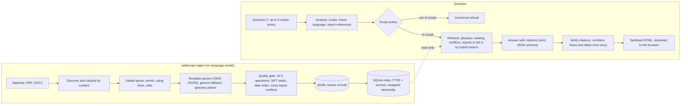

# WellScope

Grounded question answering over daily well reports: **Daily Drilling Reports (DDR)**, **Daily
Geological Operations Summaries (DGOS)** and an **Oil & Gas glossary**. Every answer cites the
passages it comes from; anything the documents do not cover gets a consistent, polite refusal
that points back to the topics it can answer.

> **Ringkasan (Bahasa Indonesia).** WellScope adalah aplikasi chat yang hanya menjawab dari PDF
> laporan harian sumur (DDR/DGOS) dan glosarium DOCX, lengkap dengan sitasi. Cara pakai singkat:
> `uv sync` → salin `.env.example` ke `.env` dan isi `OPENAI_API_KEY` → taruh PDF dan
> `Glossaries.docx` di `data/raw/` → `uv run wellscope ingest` → `uv run wellscope serve` → buka
> <http://127.0.0.1:8000>. PDF baru yang formatnya serupa cukup ditaruh di `data/raw/` lalu
> jalankan `ingest` lagi, tanpa mengubah kode dan tanpa me-restart server. Hasil parsing (JSON)
> ada di `data/processed/`. Pertanyaan boleh dalam Bahasa Indonesia atau Inggris.

## Contents

- [Features](#features)
- [Quick start](#quick-start)
- [Prerequisites](#prerequisites)
- [Installation](#installation)
- [Configuration](#configuration)
- [Data folders](#data-folders)
- [Running](#running)
- [Adding new reports](#adding-new-reports)
- [How it works](#how-it-works)
- [JSON output](#json-output)
- [Evaluation](#evaluation)
- [Development](#development)
- [Security](#security)
- [Troubleshooting](#troubleshooting)
- [Project documentation](#project-documentation)

## Features

- **Answers only from the documents**, with a citation for every fact, in the language of the
  question (Indonesian or English). Numbers, times and dates are checked against the cited
  passages before an answer is shown; an answer whose figures still fail after one retry is
  labelled *Unverified figures*, and one that cites nothing is not shown at all.
- **Consistent refusals**: questions outside the documents get one canonical message that
  redirects to supported topics; questions about reports that do not exist get a *not found*
  message listing the reports that do.
- **Layout-aware parsing** of the PDF forms: hidden text is ignored, table cells are read from
  the ruling lines, operation rows that continue across pages are joined, and values clipped by
  the report's own cell borders are restored. Typed fields keep their raw text next to the
  normalised value.
- **Glossary knowledge base** with aliases (`POH` = `POOH`), multiple senses (`RT`) and the
  glossary's own uncertainty (*to be confirmed*, *meaning unknown*).
- **Time-aware**: a question about a day is matched to the reports whose period covers it (a DDR
  runs from 00:00 to 06:00 the next day, a DGOS from 06:00 the previous day).
- **One command to re-ingest**: new PDFs of a similar format are answerable after
  `wellscope ingest`, with no code changes and no server restart.
- **Web app** with streamed progress, sources panel, full-report viewer, glossary browser,
  light and dark themes, keyboard support; plus a CLI (`wellscope ask`).

## Quick start

```bash
git clone https://github.com/prodigeproject/wellscope.git
```

```bash
cd wellscope
```

```bash
uv sync
```

Copy `.env.example` to `.env` and set `OPENAI_API_KEY`. Put the dataset folder and
`Glossaries.docx` in `data/raw/` (see [Data folders](#data-folders)), then:

```bash
uv run wellscope ingest
```

```bash
uv run wellscope serve
```

Open <http://127.0.0.1:8000> and ask, for example, *"Berapa daily cost pada DDR report no. 32?"*
or *"What does BHA stand for?"*.

## Prerequisites

| Requirement | Notes |
|---|---|
| Python 3.11 or newer | Developed and tested with 3.12 on Windows 10; CI also targets 3.11 and 3.13 on Linux and Windows. |
| [uv](https://docs.astral.sh/uv/) (recommended) | Installs the exact locked versions (`uv.lock`). Plain `pip` also works, see below. |
| An OpenAI API key | Used for question analysis, answers and embeddings. Nothing else is sent to the network. |
| A modern browser | For the web app (Chrome, Edge, Firefox, Safari). |

## Installation

**With uv (recommended).** Install uv once if you do not have it (or see the
[other methods](https://docs.astral.sh/uv/getting-started/installation/)):

```bash
pip install uv
```

Then, in the project folder:

```bash
uv sync
```

Commands then run with `uv run wellscope …`.

**With pip:**

```bash
python -m venv .venv
```

Activate it (`.venv\Scripts\activate` on Windows, `source .venv/bin/activate` elsewhere), then:

```bash
pip install .
```

Commands then run as `wellscope …` (without `uv run`). Check the setup at any time with
`uv run wellscope doctor` (or `wellscope doctor` with pip); add `--online` to also check that
each configured model answers (a few tokens on your key).

`doctor` reports the Python version, whether the key is set (never its value), the data folder,
the index and, with `--online`, whether each configured model answers.

## Configuration

Settings come from environment variables or a `.env` file in the project folder. Copy
[`.env.example`](.env.example) to `.env` and put your key in it; only `OPENAI_API_KEY` is
required:

```bash
cp .env.example .env
```

(`copy .env.example .env` in the Windows command prompt.)

| Variable | Default | Purpose |
|---|---|---|
| `OPENAI_API_KEY` | — | Your key. `.env` is gitignored; the key is never logged or shown. |
| `WELLSCOPE_CHAT_MODEL` | `gpt-5.4-mini` | Writes the answers. |
| `WELLSCOPE_ANALYZER_MODEL` | `gpt-5.4-nano` | Classifies the question and rewrites follow-ups. |
| `WELLSCOPE_EMBEDDING_MODEL` | `text-embedding-3-small` | Semantic search. |
| `WELLSCOPE_DATA_DIR` | `./data/raw` | Where source PDFs and the glossary DOCX are read from. |
| `WELLSCOPE_OUTPUT_DIR` | `./data/processed` | Where JSON, the search index and the embedding cache are written. |
| `WELLSCOPE_HOST` / `WELLSCOPE_PORT` | `127.0.0.1` / `8000` | Web server address. |
| `WELLSCOPE_ALLOWED_HOSTS` | `["127.0.0.1", "localhost", "[::1]"]` | Host names the web app answers to. |
| `WELLSCOPE_MAX_QUESTION_CHARS` | `1000` | Longest accepted question. |
| `WELLSCOPE_RATE_LIMIT_PER_MIN` | `20` | Questions per minute per client (bursts of 5). |
| `WELLSCOPE_LLM_TIMEOUT_S` | `60` | Timeout of one model call (retried twice on 429/5xx). Whatever the retries, the web app ends an answer that is not ready after 170 s with a *try again* message. |
| `WELLSCOPE_CONTEXT_TOKEN_BUDGET` | `24000` | Context size; reports that fit are read in full, larger sets are searched. |
| `WELLSCOPE_LOG_LEVEL` | `INFO` | JSON logs with request ids. |
| `WELLSCOPE_LOG_QUESTIONS` | `false` | Log question text (off by default for privacy). |

If your key has no access to the `gpt-5.4` models, set both model variables to `gpt-4.1-mini`
(see [Evaluation](#evaluation) for how the choices compare). Parameters a model does not support
are dropped automatically.

## Data folders

```
data/
├─ raw/                 ← put source files here (gitignored)
│  ├─ Datasets/         ← for example the dataset folder as delivered, any sub-folders
│  │  ├─ Daily Operation Report/*.pdf
│  │  └─ Daily Geological Operations Summary/*.pdf
│  └─ Glossaries.docx
└─ processed/           ← written by `wellscope ingest` (gitignored)
   ├─ documents/<doc_id>.json   one file per report
   ├─ glossary.json
   ├─ manifest.json             what was ingested, with hashes and quality status
   ├─ quality_report.json       data-quality findings per report and across reports
   ├─ wellscope.db              SQLite search index (rebuilt on every ingest)
   └─ cache/embeddings.db       embedding cache (unchanged text is never embedded twice)
```

- Files are found recursively and recognised by **content**, not by name or folder: a DDR, a
  DGOS, a glossary (DOCX) or a generic PDF.
- Office lock files (`~$…`) and anything that is not a PDF or DOCX are skipped; a DOCX that is
  not a glossary, or a file that cannot be parsed, is listed as *quarantined* with a reason, and
  the rest continue.
- Neither the dataset nor anything in `data/processed/` is part of the repository.

## Running

| Command | What it does |
|---|---|
| `uv run wellscope ingest` | Parses every PDF/DOCX in `data/raw/`, writes the JSON and rebuilds the search index. About 10–25 s for the sample dataset (the first run also embeds). |
| `uv run wellscope serve` | Starts the web app on <http://127.0.0.1:8000>. Options `--host`, `--port`. |
| `uv run wellscope ask "…"` | Asks one question in the terminal; `--json` prints the full answer object. |
| `uv run wellscope doctor` | Checks the setup; `--online` also checks model access. |
| `uv run wellscope eval` | Scores the pipeline on a golden question set (see [Evaluation](#evaluation)). |
| `uv run wellscope schema` | Writes the JSON Schemas of the output files to `docs/schemas/`. |

Example:

```bash
uv run wellscope ask "Apa yang terjadi pada 20 Juli 2026 pukul 04:00-06:00?"
```

The web app shows each stage while it works (understanding the question, finding sources,
writing, checking), then the answer with a status badge (*Answered*, *Not in the documents*,
*Out of scope*, *Unverified figures*), notes on data conflicts, and citation chips. Selecting a
citation shows the exact passage, with the quoted figures highlighted, and a link to the full
report.

## Adding new reports

1. Copy the new PDFs (and, if it changed, the glossary DOCX) anywhere under `data/raw/`.
2. Run `uv run wellscope ingest`.

That is all: reports in the same DDR or DGOS format are parsed with the same templates, other
PDFs are kept as page text, and a running server picks up the new index on its next request.
Removed source files also disappear from the outputs. Re-ingesting unchanged files makes no
embedding calls.

## How it works



- **Parsing is deterministic.** Report forms are described by templates
  (`src/wellscope/ingestion/pdf/templates/*.yaml`); text hidden in the PDF is dropped; every
  visible table and passage is kept in the JSON even without a typed field.
- **Retrieval reads whole reports when they fit** the context budget, so a fact cannot be missed
  by search; larger collections use BM25 and embeddings fused by reciprocal rank fusion. Totals
  of the operations table are computed exactly and given to the model as their own passage.
- **Answers are constrained**: two model calls per question (analysis, answer), sources wrapped
  in nonce-delimited tags and escaped, a strict output schema, and a deterministic verifier.
- Design rationale: [docs/PLANNING.md](docs/PLANNING.md) and the
  [architecture decision records](docs/adr/README.md).

## JSON output

`wellscope ingest` writes four kinds of JSON file to `data/processed/`. Formal JSON Schemas are in
[`docs/schemas/`](docs/schemas/). The examples below use **dummy data**.

**`manifest.json`** — what was ingested:

```json
{
  "schema_version": "1.0",
  "generated_at": "2026-01-16T08:00:00Z",
  "parser_version": "1.4.1",
  "index_version": "4f1c2a9e7b30",
  "documents": [
    {
      "doc_id": "ddr-well-a-1-0012",
      "doc_type": "DDR",
      "title": "Daily Operation Report",
      "well": "WELL-A-1",
      "report_number": 12,
      "report_date": "2026-01-14",
      "source_file": "Datasets/Daily Operation Report/WELL-A-1_DDR_12.pdf",
      "sha256": "9b0e…",
      "page_count": 7,
      "quality_status": "warning",
      "json_path": "documents/ddr-well-a-1-0012.json"
    }
  ],
  "glossary": {"source_file": "Glossary.docx", "sha256": "51aa…", "entries": 3, "json_path": "glossary.json"},
  "quarantined": [{"source_file": "scan.pdf", "reason": "parse_error", "detail": "no text layer"}]
}
```

**`documents/<doc_id>.json`** — one report. `doc_id` is `<type>-<well>-<report number>`. Every
typed field keeps the raw text from the PDF, plus a parsed value, unit or date when there is one;
empty fields are kept (an empty `raw` means *not recorded*):

```json
{
  "schema_version": "1.0",
  "doc_id": "ddr-well-a-1-0012",
  "doc_type": "DDR",
  "title": "Daily Operation Report",
  "source": {
    "file_name": "WELL-A-1_DDR_12.pdf",
    "relative_path": "Datasets/Daily Operation Report/WELL-A-1_DDR_12.pdf",
    "sha256": "9b0e…",
    "page_count": 7,
    "parser": {"name": "wellscope", "version": "1.4.1", "template": "ddr@1"}
  },
  "well": {"name": "WELL-A-1", "wellbore": "OH", "field": "FIELD-A", "block": "BLK-1",
           "region": "R1", "rig": "RIG-7", "operator": "ACME ENERGY"},
  "report": {"number": 12, "date": "2026-01-14",
             "period_start": "2026-01-14T00:00:00", "period_end": "2026-01-15T06:00:00"},
  "fields": {
    "daily_cost": {"label": "Daily Cost", "section": "costs", "raw": "250,000.00",
                   "value": 250000.0, "unit": null, "date": null, "page": 1},
    "md": {"label": "MD", "section": "depth_days", "raw": "1,520.00 m",
           "value": 1520.0, "unit": "m", "date": null, "page": 1},
    "spud_date": {"label": "Spud date", "section": "well_info", "raw": "02/01/2026",
                  "value": null, "unit": null, "date": "2026-01-02", "page": 1},
    "end_date": {"label": "End date", "section": "well_info", "raw": "",
                 "value": null, "unit": null, "date": null, "page": 1}
  },
  "operations": [
    {"seq": 1, "date": "2026-01-14", "start": "00:00", "end": "06:30", "hours": 6.5,
     "phase_code": "D18", "activity_code": "DRL", "productive_code": "OPRN", "npt": false,
     "rig_status": "OPRN", "md_from_m": 1480.0,
     "description": "Drill 12-1/4\" hole from 1,480 m to 1,520 m.", "page": 2}
  ],
  "next_day": {"date": "2026-01-15",
               "entries": [{"start": "00:00", "end": "06:00", "description": "Circulate hole clean.", "page": 2}]},
  "remarks": [],
  "tables": [
    {"section": "lot_fit", "page": 6, "header_rows": 1,
     "rows": [["Date", "EMW", "MAASP"], ["12/01/2026", "14.90", "2,100.00"]]}
  ],
  "sections": [{"section": "weather", "page": 7, "text": "Wind 12 knots, sea state moderate"}],
  "pages": [{"number": 1, "text": "DAILY OPERATION REPORT …", "visible_ratio": 0.98}],
  "quality": [
    {"id": "operations.hours_total", "ok": true, "severity": "warning", "detail": "24.00 h of 24.00 h"},
    {"id": "dates.spud_before_report", "ok": true, "severity": "warning", "detail": "spud 2026-01-02, report 2026-01-14"}
  ]
}
```

A DGOS file has the same shape: its progress grid, location, rig and well data become `fields`;
its remarks go to `remarks` (`{"number": 1, "text": "…"}`); casing, formation tops and gas or oil
shows go to `tables`. Its report period runs from 06:00 on the previous day to 06:00 on the
report date. Other PDFs (`doc_type: "GENERIC"`) keep their visible text in `pages` and their
ruled tables in `tables`.

**`glossary.json`**:

```json
{
  "schema_version": "1.0",
  "source": {"file_name": "Glossary.docx", "relative_path": "Glossary.docx", "sha256": "51aa…",
             "page_count": 0, "parser": {"name": "wellscope", "version": "1.4.1", "template": "glossary@1"}},
  "entries": [
    {"id": "gl-abc", "term": "ABC", "aliases": ["ABC", "A.B.C."], "expansion": "Alpha Beta Charlie",
     "description": "Example definition.", "status": "confirmed", "senses": [],
     "category": "abbreviation", "source_row": 4},
    {"id": "gl-xyz", "term": "XYZ", "aliases": ["XYZ"], "expansion": null,
     "description": "Appears in a report field; meaning not stated.", "status": "unknown",
     "senses": [], "category": "abbreviation", "source_row": 9}
  ]
}
```

**`quality_report.json`** — findings that the answers can mention as caveats:

```json
{
  "schema_version": "1.0",
  "generated_at": "2026-01-16T08:00:00Z",
  "documents": [{"doc_id": "ddr-well-a-1-0012", "status": "warning", "failed_checks": ["dates.bop_test_order"]}],
  "cross_document": [
    {"id": "conflict.spud_date", "severity": "warning", "detail": "Spud date differs between documents.",
     "values": [{"doc_id": "ddr-well-a-1-0012", "value": "2026-01-02"},
                {"doc_id": "dgos-well-a-1-0013", "value": "2025-01-02"}]}
  ]
}
```

## Evaluation

`wellscope eval` runs a golden question set through the full pipeline and scores the answers
deterministically: expected status, required facts (numbers and dates match in any notation, for
example `250,000.00` = `250.000,00`), and cited documents. It reports accuracy per category with
95% confidence intervals, refusal precision and recall, latency and tokens.

The golden set used for this project has 97 questions in Indonesian and English (glossary, DDR
and DGOS facts, cross-report and follow-up questions, data conflicts, missing data, out-of-scope
questions and injection attempts). It contains facts from the dataset, so it is kept out of the
repository; [`evals/golden.example.yaml`](evals/golden.example.yaml) shows the format. Final
run with the default models: **97 of 97 correct**, no false refusals, every question that
should be refused was, every figure shown verified, about 3 s per answer (p95 5.0 s), about
USD 0.01 per question. Facts that can be computed (report resolution, totals, data conflicts,
figure checks) are computed in code, so the model's run-to-run variance is limited to wording
([ADR-0009](docs/adr/0009-deterministic-facts-model-for-language.md)). Model
answers can vary slightly between runs. Details, the path to this result and the model
comparison: [docs/EVALUATION.md](docs/EVALUATION.md).

## Development

```bash
uv run pytest
```

```bash
uv run ruff check . && uv run ruff format --check . && uv run mypy
```

- 394 tests (unit, integration, API, contract and architecture), 95% line coverage; tests that
  need the real dataset are marked `dataset` and skip when it is absent; no test calls OpenAI.
- `pre-commit install` enables the same checks before each commit, plus secret and dataset
  guards.
- Code layout, layer rules (enforced by tests), size limits and commit conventions:
  [docs/STANDARDS.md](docs/STANDARDS.md). Specification: [docs/specs/](docs/specs/).

## Security

- The key lives only in `.env` (gitignored) and is held as a secret value; logs redact keys and
  record question text only when `WELLSCOPE_LOG_QUESTIONS=true`. Model calls use `store=false`.
- The web app binds to `127.0.0.1`, refuses unknown host names, sends a strict Content Security
  Policy (no inline script), limits request size and rate, and has no upload or ingest endpoint.
- Answers are rendered from Markdown with raw HTML disabled and then passed through an
  allow-list sanitiser; links and images are never rendered.
- Document text reaches the model only as escaped data inside nonce-delimited tags, with rules
  that it is data, not instructions.

Threat model, residual risks and scan results: [docs/SECURITY.md](docs/SECURITY.md).

## Troubleshooting

| Symptom | Fix |
|---|---|
| `doctor` says the key is not set | Create `.env` from `.env.example` in the project folder (where you run the command) and set `OPENAI_API_KEY`. |
| "The configured model is not available to this key" | Set `WELLSCOPE_CHAT_MODEL` and `WELLSCOPE_ANALYZER_MODEL` to a model your key can use, e.g. `gpt-4.1-mini`; check with `wellscope doctor --online`. |
| The web app says "No data yet" | Run `uv run wellscope ingest`; the page picks up the index on reload. |
| A file is listed as quarantined | The reason is shown; scanned PDFs without a text layer cannot be read (no OCR). |
| Port 8000 is in use | `uv run wellscope serve --port 8001`. |
| Opening the app via another host name or IP returns 400 | Add the name to `WELLSCOPE_ALLOWED_HOSTS`, e.g. `["127.0.0.1", "localhost", "my-host"]`. |
| Garbled characters in a Windows console | Use Windows Terminal; WellScope already writes UTF-8. |
| Answers marked *Unverified figures* | A figure in the answer was neither in the cited passages nor calculated from them, even after one retry; check the sources panel. |

## Project documentation

| Document | Contents |
|---|---|
| [docs/PLANNING.md](docs/PLANNING.md) | Approach, architecture, technology choices and plan |
| [docs/RESOLUTION.md](docs/RESOLUTION.md) | Obstacles met, how they were solved, known limits and next steps |
| [docs/EVALUATION.md](docs/EVALUATION.md) | Evaluation method, results and model comparison |
| [docs/UAT.md](docs/UAT.md) | Acceptance criteria and results |
| [docs/GO_NO_GO.md](docs/GO_NO_GO.md) | Release gates, ROI and the release decision |
| [docs/SECURITY.md](docs/SECURITY.md) | Threat model, controls, residual risks |
| [docs/DATA_QUALITY.md](docs/DATA_QUALITY.md) | Data-quality checks and how anomalies are handled |
| [docs/TECH_DEBT.md](docs/TECH_DEBT.md) | Known technical debt and its plan |
| [docs/STANDARDS.md](docs/STANDARDS.md) | Engineering standards |
| [docs/specs/](docs/specs/) | Requirements (EARS), design and tasks |
| [docs/adr/](docs/adr/README.md) | Architecture decision records |
| [CHANGELOG.md](CHANGELOG.md) | Changes per version |

## License

[MIT](LICENSE)
