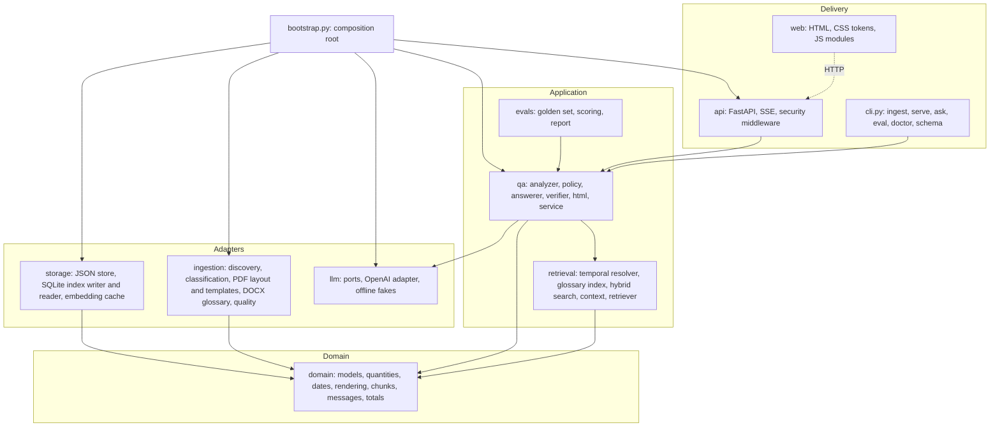

# Planning

The approach, the architecture, why each technology was chosen, and how the work was planned.
Obstacles met on the way and how they were solved are in [RESOLUTION.md](RESOLUTION.md).

## 1. Goal and requirements

Build a chat application that answers questions **only** from a set of daily well reports
(Daily Drilling Report, DDR, and Daily Geological Operations Summary, DGOS, both PDF) and an Oil
& Gas glossary (DOCX), refuses everything else consistently, and can take new reports of a
similar format by re-running one command.

| Explicit requirement (from the brief) | Where it is met |
|---|---|
| Answer only from the PDFs and the glossary | Grounded answer prompt, scope policy, verifier ([design](specs/design.md)) |
| Consistent out-of-scope refusal that redirects to supported topics | Canonical messages in Indonesian and English (`domain/messages.py`), locked by tests |
| Glossary as a knowledge base | `ingestion/docx/glossary_parser.py`, `retrieval/glossary_index.py` |
| Parse PDF and DOCX into structured JSON | `wellscope ingest` → `data/processed/` ([README: JSON output](../README.md#json-output)) |
| One command, new similar PDFs, no code changes, immediately answerable | Content-based classification, template parsers, hot reload of the index ([UAT-03](UAT.md)) |
| README with prerequisites, install, configuration, run commands, JSON structure with dummy data, dataset and output locations | [README](../README.md) |
| API key never in the repository; `.env` and `.env.example` | `.gitignore`, pre-commit key guard, `SecretStr` settings |
| Dataset and parsed JSON not uploaded | `.gitignore` and a pre-commit guard for PDF, DOCX, databases and output JSON |
| Answers within 3 minutes | p95 4.4 s, maximum 10 s on the golden set ([EVALUATION](EVALUATION.md)) |
| Documentation of planning and resolution | This document and [RESOLUTION.md](RESOLUTION.md) |
| Nice to have: a real database | SQLite with FTS5 and stored vectors |

Implicit requirements, inferred from the evaluation criteria and from reading the data, shaped
most decisions:

- **Accuracy on tables and numbers.** The reports are dense forms: costs, depths, codes, a
  24-hour operations table. A wrong digit is a wrong answer, so values must be read exactly and
  checked.
- **Honesty under uncertainty.** The data has conflicts (the same fact stated differently in two
  report types) and blank fields; answers must say so instead of picking one value.
- **Bilingual use.** Reviewers may ask in Indonesian; the reports are in English.
- **Runs on the reviewer's machine first time.** Windows included, with the reviewer's own key,
  which may not have access to the newest models.
- **Unknown follow-up PDFs.** "Similar" PDFs may be other reports from the same system, or a
  different layout entirely; the first must parse fully, the second must still be answerable.

## 2. Approach

**Structured-first retrieval-augmented generation** ([ADR-0001](adr/0001-structured-first-rag.md)).

Early experiments decided the direction:

1. Plain text extraction of the DGOS interleaves a hidden text layer with the visible one
   (white text on white, labels painted over by later shapes), producing unreadable strings.
   Feeding raw text to a model was therefore ruled out; the parser had to reason about what is
   *visible* ([ADR-0002](adr/0002-visibility-aware-pdf-parsing.md)).
2. Given a report as raw text, several models answered header facts correctly but failed on
   table questions ("which operations were non-productive time?"). Given the same report as
   structured rows, they answered correctly. So the investment goes into **deterministic,
   layout-aware parsing**; the language model only reads clean, labelled passages.
3. A whole report rendered as labelled Markdown is about 5k tokens (DDR) or 2k (DGOS). When the
   relevant reports fit the context budget, they are given **in full**, which removes retrieval
   misses entirely; search (BM25 plus embeddings) is the fallback for larger collections
   ([ADR-0004](adr/0004-adaptive-hybrid-retrieval.md)).

The language model is used for two narrow tasks per question, never during ingestion:

- a small model classifies the question (scope, intent, language, report references) and
  rewrites follow-ups;
- a mid-size model writes the answer from numbered sources under a strict JSON schema.

Everything around those two calls is deterministic and tested: report resolution by period,
glossary matching, scope policy, context assembly, verification of citations and figures,
rendering.

## 3. Architecture

Ports and adapters, with the rules enforced by an architecture test that parses imports:

| Layer | Owns | May not import |
|---|---|---|
| `domain` | Pydantic models, value parsing, rendering, canonical messages | frameworks, OpenAI, SQLite, PDF libraries, any other layer |
| `ingestion` | Reading PDFs and DOCX into domain documents | storage, retrieval, LLM, QA, API |
| `storage` | JSON files and the SQLite index | ingestion, retrieval, LLM, QA, API |
| `llm` | Model ports, the OpenAI adapter, fakes | storage, retrieval, QA, API |
| `retrieval` | Finding evidence through the `ReportIndex` port | storage, SQLite, the OpenAI adapter, QA, API |
| `qa` | The question pipeline | storage, SQLite, the OpenAI adapter, API |
| `api` | HTTP, streaming, web security | storage, ingestion, the OpenAI adapter |

Two data stores, with clear roles ([ADR-0003](adr/0003-json-source-of-truth-sqlite-projection.md)):
the JSON files are the **source of truth** (human-readable, schema-validated, required by the
brief); the SQLite file is a **projection** rebuilt from them on every ingest, written to a
temporary file and swapped in atomically, then read through short-lived read-only connections.
A running server notices the new index version on its next request.

Ingest flow: discover files recursively → classify by content → visible layout (painter's
algorithm, ruling lines, cells) → template parser (DDR, DGOS) or generic fallback → quality gate
(operations total 24 hours, NPT rows match the header, date order, cross-report conflicts) →
JSON → chunks, embeddings (cached by text hash), SQLite FTS5 and vectors.

Question flow: clean input → analyse (model, with deterministic extraction of report numbers and
dates that overrides the model) → scope policy → resolve reports by number, type, date or
period → gather glossary entries, catalog, conflicts and report passages within the token
budget → answer (strict schema, numbered nonce-delimited sources) → verify citations, numbers,
times and dates (regenerate once with feedback) → sanitised HTML, streamed as server-sent
events.

## 4. Technology choices

| Area | Choice | Why | Alternatives considered |
|---|---|---|---|
| Language | Python 3.11+ | Best PDF and AI ecosystem; typed with mypy strict | — |
| PDF | pdfplumber (pdfminer.six) | Character-level access with colours and drawing order, needed to decide visibility; ruling-line tables | PyMuPDF (AGPL licence), raw `pdftotext` (no visibility), OCR (not needed: text layers exist) |
| DOCX | python-docx | Glossary tables read cell by cell | Raw XML |
| Models of the data | Pydantic v2, strict (`extra="forbid"`) | Validation, JSON Schema export, one definition for files and code | dataclasses only |
| Search index | SQLite FTS5 + vectors in BLOBs, cosine in numpy | Zero services to install; BM25 with a tokenizer that keeps `17-1/2` and `10.0ppg` whole; the vector set is small | A vector database (extra service), sqlite-vec (extension loading varies by platform) |
| Language models | OpenAI Responses API, structured outputs, `store=false` | The brief asks for OpenAI; strict JSON schema output; no retention | Chat Completions (works too; the Responses API is the current interface for structured outputs) |
| Model defaults | `gpt-5.4-mini` answers, `gpt-5.4-nano` analysis, `text-embedding-3-small` | Measured: best accuracy per cost and fastest ([EVALUATION](EVALUATION.md)) | `gpt-4.1-mini` (fallback), `gpt-5.5` (slower, costlier) |
| Web API | FastAPI + server-sent events | Typed validation, OpenAPI, streaming of pipeline stages | WebSockets (more moving parts) |
| Front end | Plain HTML, CSS custom properties, ES modules; no build step | Runs from a fresh clone with nothing else to install; a strict CSP is easy without bundlers ([ADR-0007](adr/0007-no-build-web-ui.md)) | React + Vite (a Node toolchain for reviewers) |
| Markdown to HTML | markdown-it-py with HTML disabled, then nh3 allow-list | Model output never becomes markup it did not pass through a sanitiser | Rendering in the browser |
| Tooling | uv, ruff, mypy, pytest, Hypothesis, reportlab (synthetic PDFs), pre-commit | Fast, reproducible, enforce the standards automatically | — |

## 5. Plan and prioritisation

Work was specified before it was built: [requirements](specs/requirements.md) in EARS form,
[design](specs/design.md) with correctness properties, and [tasks](specs/tasks.md) traced to
requirements. Each behaviour was introduced test first: the history shows a `test:` commit
before the `feat:` or `fix:` commit that makes it pass.

Features were ranked by expected value against effort and risk (the scoring and the full table
are in the private planning notes; [GO_NO_GO.md](GO_NO_GO.md) summarises the gates). The order
of phases followed the ranking:

| Phase | Content | Why in this order |
|---|---|---|
| P0 | Specification, standards, ADRs, scaffold | Agree on the target before building |
| P1 | Visibility filter, layout geometry, DDR and DGOS templates, glossary parser, quality gate, JSON store | Everything downstream depends on correct values |
| P2 | Index, embeddings with cache, resolver, glossary index, hybrid search, analyzer, policy, answerer, verifier | The core of accuracy and refusals |
| P3 | API with security controls, web app | Required delivery; designed while P2 stabilised |
| P4 | Golden set and evaluation; fixes driven by its failures | Measure, then tune with evidence |
| P5 | Security review, documentation, acceptance tests | Runnable and reviewable by a stranger |

Cut list prepared in advance in case time ran short (in this order): model comparison, dark
theme, full-report viewer, glossary browser, generic PDF fallback. None had to be cut.

## 6. Risks and mitigations

| Risk | Mitigation |
|---|---|
| Hidden text corrupts values | Painter's-algorithm visibility filter; visible-ratio recorded per page and checked |
| Reviewer's PDFs differ from the samples | Classification by content; templates with label aliases; generic fallback keeps every page answerable |
| Hallucinated numbers | Sources only, strict schema, verifier for citations, numbers, times and dates, one regeneration, then an *Unverified* label |
| Prompt injection through PDFs | Nonce-delimited, escaped sources declared as data; no tools, read-only data path; tested with a planted instruction |
| Model not available on the reviewer's key | Configurable models, automatic removal of unsupported parameters, `doctor --online` |
| Windows-specific failures | Developed on Windows; UTF-8 console output forced; atomic file replacement retried; `.js` MIME type registered |
| Running out of time | Phased plan with a cut list; documentation written alongside the code |
