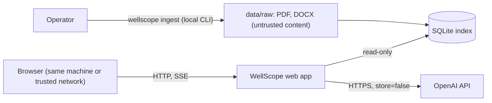

# Security

WellScope runs locally, reads documents the operator puts on disk, and sends prompts to an
external model API. This document lists the threats considered, the controls in place, how
they are tested, the results of the last scans and the risks that remain.

## Scope and trust boundaries

- **Untrusted inputs:** questions typed in the browser, and the *content* of any PDF or DOCX an
  operator adds (a report may contain text written to manipulate a model).
- **Secrets:** the OpenAI API key, read from the environment or `.env`.
- **Assets:** the reports (possibly confidential), the key, the operator's API budget.

## Threats and controls

Threats are grouped by STRIDE and by the OWASP Top 10 for LLM Applications (2025).

| Threat | Vector | Controls | Verified by |
|---|---|---|---|
| Prompt injection, direct (LLM01) | A question tries to change the rules or extract the prompt | Analyzer classifies `unsafe`; scope policy refuses with the canonical message; the prompt holds no secrets; answers follow a strict JSON schema | Golden set (`out_of_scope`, `injection` categories): all refused |
| Prompt injection, indirect (LLM01) | Text inside a PDF tells the model to do something | Sources are HTML-escaped and wrapped in tags carrying a per-request random nonce, declared as data; the model has no tools; the data path is read-only; the verifier rejects figures not in cited sources | `tests/unit/retrieval/test_context.py`; UAT-07 with a planted instruction |
| Improper output handling, XSS (LLM05) | Model output or document text rendered in the browser | Markdown rendered with raw HTML disabled, then an allow-list sanitiser (nh3) with no attributes, links or images; citation buttons built from validated ids; Content Security Policy `script-src 'self'` with no inline script or style; DOM built with `textContent` elsewhere | `tests/unit/qa/test_html.py`, `tests/api/test_api.py` |
| Sensitive information disclosure (LLM02) | Key in logs, errors or the repository; documents retained by the provider | Key held as `SecretStr` and never printed (`doctor` shows only whether it is set); JSON logs redact key patterns; question text is logged only when `WELLSCOPE_LOG_QUESTIONS=true`; error responses are generic with a request id; model calls use `store=false`; `.env`, the dataset and outputs are gitignored and blocked by pre-commit hooks | `tests/unit/test_observability.py`, `tests/api/test_api.py`, history scan below |
| System prompt leakage (LLM07) | "Show your instructions" | Nothing confidential is in the prompts (they are in the repository); such requests are classed `unsafe` | Golden set |
| Excessive agency (LLM06) | The model acting on data | No tools or function calling; no write path from the API; no upload or ingest endpoint | Architecture tests (`api` cannot import `ingestion` or `storage`) |
| Misinformation (LLM09) | Hallucinated or mis-copied facts | Answers only from cited sources; verifier for citations, numbers, times and dates with one regeneration, then an *Unverified* label; canonical *not found* when the sources lack the answer | `tests/unit/qa/test_verifier.py`, golden set |
| Unbounded consumption (LLM10), denial of service | Request floods, huge inputs, costly prompts | Rate limit per client (20/minute, bursts of 5, bounded table); request bodies over 16 KB rejected before parsing; question length limit; history limited to 3 turns; output token caps; model timeouts; at most 4 concurrent model calls | `tests/api/test_api.py`, `tests/unit/api/test_ratelimit.py` |
| DNS rebinding | A web page makes the browser call `127.0.0.1:8000` under its own host name | Host header allow-list (`WELLSCOPE_ALLOWED_HOSTS`); no CORS headers | `tests/api/test_api.py::test_unknown_hosts_are_refused` |
| Clickjacking, MIME sniffing, referrer leaks | Browser behaviour | `frame-ancestors 'none'`, `X-Frame-Options: DENY`, `X-Content-Type-Options: nosniff`, `Referrer-Policy: no-referrer`, COOP and CORP same-origin, restrictive `Permissions-Policy`; API responses `Cache-Control: no-store` | `tests/api/test_api.py` |
| Path traversal | Report ids in URLs | Reports are addressed by id matching `^[a-z0-9][a-z0-9-]{2,79}$`, looked up in the index; no file path reaches the API | `tests/api/test_api.py::test_sources_accept_only_report_ids` |
| Malicious or huge files at ingest | Crafted PDFs | Files only enter through the local CLI; size limit (50 MB) and page limit (200) per file; each file parsed in isolation and quarantined on failure; files resolving outside the data folder are rejected; JSON written atomically | `tests/integration/test_pipeline.py` |
| SQL injection | Values reaching SQLite | Parameterised queries only; lists passed as one JSON parameter (`json_each`), so no SQL text is built from values; FTS terms quoted as phrases | `tests/unit/storage/test_search_index.py` |
| Supply chain (LLM03) | Compromised dependencies or actions | Locked dependencies (`uv.lock`); `pip-audit`; Dependabot for Python and Actions; GitHub Actions pinned by commit SHA; CodeQL workflow for when the repository is public | Scan results below |

## Scan results

Run on 8 October 2026 against the commit being submitted.

| Check | Result |
|---|---|
| `pip-audit` on the locked dependency set | No known vulnerabilities |
| Secret scan of the full git history (OpenAI key patterns) | No matches |
| Tracked files: PDF, DOCX, databases, `data/processed` JSON | None |
| Dataset values and names in tracked files | None (fixtures use invented values) |
| Ruff security rules (`S`, flake8-bandit) on all sources | Clean; the one suppression (S104, a constant compared against, not bound) is explained in place |
| `gitleaks` and CodeQL in CI | Configured; not yet executed because GitHub Actions does not start on the private repository (see [RESOLUTION.md](RESOLUTION.md) #20) |

## Residual risks

- Prompt-injection defences reduce the risk; no defence eliminates it. A malicious document can
  still bias an answer about itself; it cannot reach tools, other users or the file system.
- No authentication: the app is meant for one user on a local machine. Exposing it on a network
  needs a reverse proxy with authentication and TLS.
- The rate limiter lives in one process and keys on the client address; behind a proxy it sees
  the proxy's address.
- Documents are sent to the model provider for answering (`store=false`, but they do leave the
  machine). Confidential reports need an approved provider agreement.
- The visibility filter can be fooled by PDF features it does not model (clipping paths,
  transparency groups); hidden text would then reach the index.

## Reporting a vulnerability

Please open a private security advisory on the repository, or contact the maintainers listed in
the repository profile. Do not include real API keys or confidential documents in a report.
