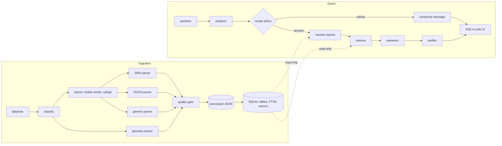

# Design — WellScope

**Status:** approved v1.0 · Implements `requirements.md` · Decisions: `docs/adr/`

## 1. Overview

WellScope has two paths that meet at a JSON contract:

- **Ingestion (offline, deterministic, no LLM):** PDF/DOCX → visible layout → typed documents →
  JSON (source of truth) → SQLite projection (tables, FTS5 index, embeddings).
- **Query (online):** question → analysis → scope policy → document resolution → retrieval →
  cited answer → verification → sanitised HTML streamed to the UI.

## 2. Principles

1. Structure before generation: models reason over parsed tables, not raw page text.
2. What you see is what you parse: only rendered-visible text enters the system.
3. Deterministic where possible; the LLM is used for language, not for bookkeeping.
4. Fail soft and visibly: per-file quarantine, quality findings, degraded retrieval, explicit
   answer status.
5. Least privilege: read-only query path, no ingest/upload over HTTP, untrusted text is escaped.

## 3. Architecture

## 4. Components and interfaces

| Package | Responsibility | Key types / functions |
|---|---|---|
| `domain` | Pure models and rules | `Quantity`, `ReportDocument`, `GlossaryEntry`, `Answer`, `Citation`, canonical messages |
| `ingestion.pdf` | Visible layout and form parsing | `load_pages()`, `PageLayout`, `Word`, `FormTemplate`, `parse_ddr()`, `parse_dgos()` |
| `ingestion.docx` | Glossary parsing | `parse_glossary()` |
| `ingestion` | Orchestration, normalisation, quality, chunking | `run_ingest()`, `check_document()`, `chunk_document()` |
| `storage` | JSON and SQLite adapters | `JsonStore`, `SqliteIndexWriter`, `SqliteReader` |
| `retrieval` | Resolution and retrieval | `resolve_reports()`, `GlossaryIndex`, `hybrid_search()`, `build_context()` |
| `llm` | Model ports, OpenAI adapter, fakes, prompts | `ChatModel`, `Embedder`, `OpenAIChatModel`, `FakeChatModel`, `HashEmbedder` |
| `qa` | Question pipeline | `QuestionService`, `analyze()`, `decide_scope()`, `verify_answer()`, `render_html()` |
| `api` | HTTP + SSE, security middleware | `create_app()` |
| `web` | Static UI (no build) | ES modules, design tokens |

Ports (`typing.Protocol`) are owned by their consumers; adapters depend inwards only.

## 5. Data model

- Every value extracted from a form is a `Quantity`-like triple `{value, unit, raw}` or a raw
  string; dates are ISO-8601 with the raw text kept.
- A report document has: `source` (file, sha256, pages, parser and template version), `well`,
  `report` (number, date, period start/end), typed sections, `generic` (all key-value pairs,
  tables and page text) and `quality` (checks and findings).
- Schemas are generated from the Pydantic models into `docs/schemas/`; the README shows dummy
  examples.

## 6. Ingestion design

1. **Visibility (painter's algorithm).** Walk pdfminer layout objects in content-stream order. A
   character is visible when no later opaque filled shape covers its centre and its fill colour
   contrasts with the last filled shape beneath it (page background is white).
2. **Layout primitives.** Visible characters → words (with positions) → lines by
   tolerance-based clustering. Vertical and horizontal rulings come from page edges and give
   table column boundaries and cell boxes.
3. **Form templates (`*.yaml`).** Signatures, section titles, field labels and aliases, table
   headers and invariants. Format variations are handled by editing templates, not code.
4. **Parsers.** Section regions are located by their titles; key-value pairs are extracted by
   known-label segmentation (inline `Label : value`) or label-column blocks (narratives); tables
   map words to ruling-derived columns. Unknown content is still captured generically.
5. **Normalisation.** Numbers with thousands separators, units, unicode fractions (`17½"`), sizes
   (`12-1/4`), dates (`19/07/2026`, `29-08-2026`) and time ranges crossing midnight.
6. **Quality gate.** Invariants per document and conflict detection across documents; results are
   findings, never silent corrections.
7. **Projection.** Chunks per section, operation row and glossary entry, each prefixed with
   metadata; FTS5 over normalised index text; embeddings cached by content hash; the database is
   written to a temporary file and swapped atomically with a new index version.

## 7. Query design

| Stage | Behaviour |
|---|---|
| Guard | Pydantic limits, Unicode normalisation, control-character stripping, rate limit, concurrency cap |
| Analyze | Small model with a strict JSON schema (language, scope, intent, standalone question, glossary terms, filters, English search queries) merged with deterministic extractors (dates, report numbers, glossary terms, catalog entities) |
| Scope policy | Pure decision table: refuse (`out_of_scope`, `unsafe`) or continue |
| Resolve | Report numbers, dates (period overlap) and "latest" → document ids; no match → `NOT_FOUND` without calling the answer model |
| Retrieve | Glossary matches; whole structured reports when they fit the token budget; otherwise hybrid BM25 ⊕ vector search fused with RRF (k = 60) plus a catalog card |
| Answer | Main model, strict JSON (`status`, `answer_markdown`, `citations`, `caveats`); sources wrapped in nonce-delimited, escaped `<source>` blocks |
| Verify | Citations ⊆ sources; numbers ⊆ numbers of cited sources; one regeneration, then `unverified` |
| Render | Markdown (HTML disabled) → sanitiser allow-list → citation buttons |

## 8. Error handling and degradation

| Failure | Behaviour |
|---|---|
| Missing API key | Server starts; chat returns a configuration error; `doctor` explains the fix |
| Model unavailable or rate-limited | Bounded retries with back-off, then a friendly error with request id |
| Embeddings unavailable | Ingest succeeds with a warning; retrieval falls back to BM25 |
| No index yet | UI and API report "run `wellscope ingest`" |
| One file fails to parse | File quarantined with reason code; others continue |
| Rate limit exceeded | HTTP 429 with `Retry-After` |

## 9. Correctness properties

| ID | Property | Validates |
|---|---|---|
| P1 | For any parsed DDR, the operation hours total 24.00 ± 0.01, or an `ops.hours_total` finding exists. | FR-2.6 |
| P2 | For any parsed DDR, NPT-flagged hours equal the header daily NPT, or a finding exists. | FR-2.6 |
| P3 | For any page, no character painted over by a later opaque shape appears in the extracted text. | FR-2.1 |
| P4 | For any normalised value, the `raw` string is preserved verbatim. | FR-2.5 |
| P5 | For any number formatted with thousands separators, parsing then formatting is the identity. | FR-2.5 |
| P6 | For any glossary row, the parser emits exactly one entry, except separator rows, which emit none. | FR-3.1, FR-3.2 |
| P7 | For any answer with status `answered`, every citation refers to a provided source. | FR-6.1 |
| P8 | For any refusal, the returned text equals the canonical message for the question language. | FR-5.3 |
| P9 | For any ingest run on identical inputs, the JSON output is byte-identical except timestamps. | NFR-3 |
| P10 | For any API error, the response body contains a request id and no stack trace. | SEC-7 |

## 10. Testing strategy

| Level | Scope | Runs in |
|---|---|---|
| Unit | Normalisation (with property tests), visibility, geometry, parsers, glossary, resolver, policy, verifier, sanitiser | local + CI |
| Integration | Ingest of synthetic PDFs → JSON → SQLite; QA pipeline with fakes | local + CI |
| Contract | Generated JSON Schema equals committed schema; prompt contracts | local + CI |
| API | Validation, security headers, rate limit, SSE format, error envelope | local + CI |
| Architecture | Import rules and size budget | local + CI |
| Dataset | Real PDFs (skipped when absent) | local |
| Evaluation | Golden question set against real models | local, on demand |
